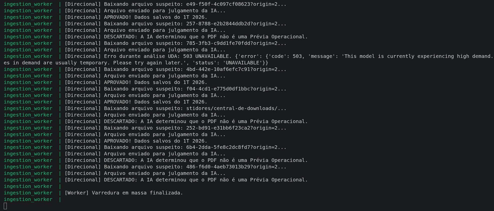
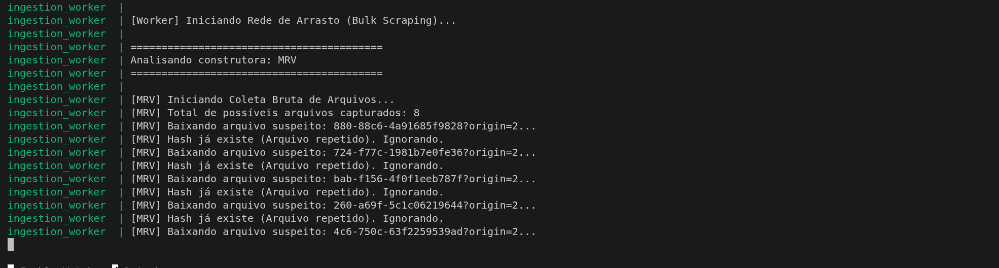
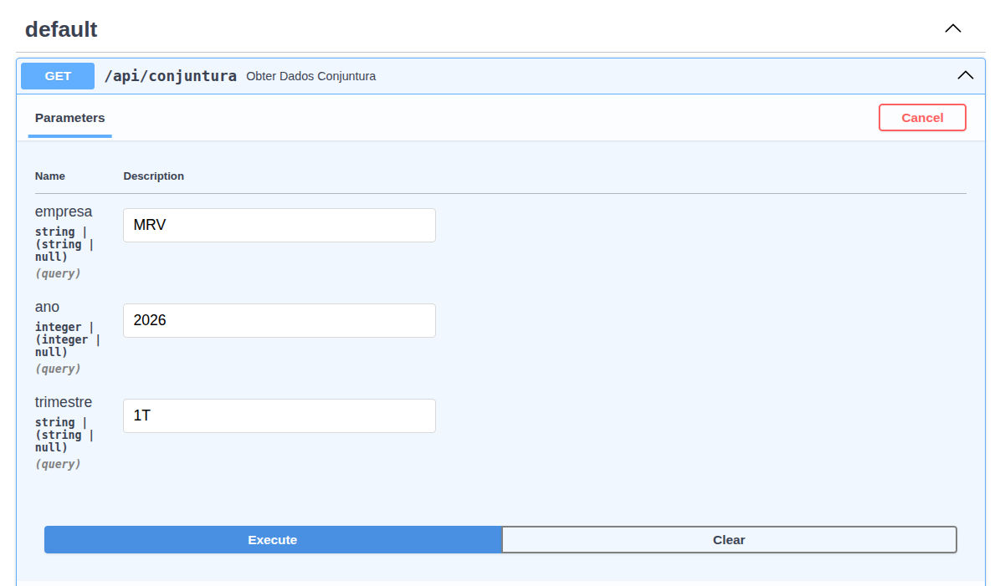
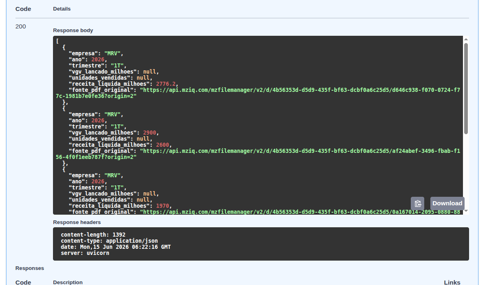
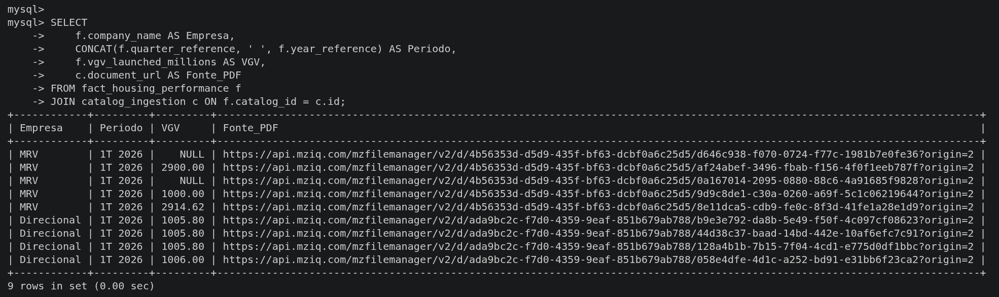

# Pipeline UDA: Monitoramento de Conjuntura Habitacional

**Autor:** Renan Rodrigues Lacerda

Este projeto implementa um Pipeline de Analise de Dados Nao Estruturados (UDA) orientado a eventos. O objetivo e automatizar a coleta, extracao e estruturacao de dados operacionais e financeiros (VGV, Unidades Vendidas) a partir de relatorios em PDF publicados nos portais de Relacoes com Investidores (RI) das construtoras.

A solucao adota uma arquitetura agnostica a layout: em vez de utilizar raspagem baseada em coordenadas ou regras estaticas, a interpretacao semantica e delegada ao LLM (Gemini 2.5 Flash), garantindo a extracao estruturada seja em relatorios tabulares ou apresentacoes visuais corporativas.

---

## Estrategias Arquiteturais e Requisitos

1. **Gatilho de Ingestao (Polling):** Rotina orquestrada para varredura automatizada diaria via `schedule`. Um scraper baseado em Playwright extrai os links das Centrais de RI previamente mapeadas.
2. **Idempotencia Híbrida (Rede e Catalogo):** O pipeline neutraliza o retrabalho em duas camadas:
    - **Filtro de URL:** Evita o download fisico se a URL ja constar no banco (`catalog_repo.exists_by_url`), poupando a infraestrutura das construtoras.
    - **Assinatura Criptografica:** Calcula o Hash SHA-256 do binário para os arquivos novos. O processamento por LLM so é acionado se a assinatura for inédita no catálogo.
3. **Estrategia de Segmentacao (Full-Scan):** A biblioteca `pymupdf4llm` e utilizada para converter a totalidade do PDF em Markdown. O envio do texto integral aproveita a extensa janela de contexto do LLM para preservar a integridade espacial dos dados, mitigando o risco de cortes acidentais inerentes ao chunking convencional.
4. **Contrato Semantico e Qualidade de Dados:** O modelo `HousingMetricsContract` (Pydantic) e integrado via *Structured Outputs*. O sistema instrui a IA a validar o tipo do documento (`is_valid_document`) para evitar a ingestao de informacoes fora de escopo (como editais e comunicados). A instrucao de sistema exige a extracao de dados brutos e absolutos, descartando metricas percentuais relativas voltadas ao marketing institucional.
5. **Catalogo de Dados e Linhagem:** A arquitetura relacional associa a tabela de metricas (`fact_housing_performance`) ao registro original de captura (`catalog_ingestion`). O endpoint da API expoe diretamente a URL do documento fonte, estabelecendo a rastreabilidade ponta a ponta.

---

## Evidencias Visuais do Pipeline em Execucao

Abaixo estao as demonstracoes das camadas de extracao, estruturacao e linhagem operando integradas:

### 1. Ingestao e Triagem Cognitiva (Worker Logs)
Demonstracao do motor de descoberta operando e do LLM atuando como classificador (descartando PDFs invalidos e aprovando relatorios operacionais reais).

### 2. Camada de Servico e Linhagem (API / Swagger)
Resposta estruturada do endpoint de integracao, comprovando a tipagem dos dados temporais e a exibicao transparente da fonte do dado original (Data Lineage).

### 3. Persistencia Relacional (Banco de Dados)
Consulta SQL demonstrando a gravacao dos dados financeiros e as chaves estrangeiras que conectam a tabela fato ao catalogo de ingestao de forma idempotente.

---

## Arquitetura da Solucao (Infraestrutura)

O ecossistema roda de forma desacoplada em tres conteineres Docker:
* **MySQL (`pipeline_mysql`):** Persistencia de dados e controle de estado do catalogo.
* **Worker de Ingestao (`python_worker`):** Modulo assincrono responsavel pelo scraping de busca, download e integracao direta com a API do Google Gemini.
* **API REST (`conjuntura_api`):** Servico em FastAPI para interfaceamento dos dados de conjuntura.

---

## Guia de Inicializacao e Teste

### 1. Variaveis de Ambiente
Crie um arquivo `.env` na raiz do projeto contendo as seguintes credenciais:

GEMINI_API_KEY=sua_chave_aqui

### 2. Ingestão Manual via Diretório (Upload Local)
Caso queira analisar PDFs sem depender do scraper web, crie e utilize o diretório raiz `local_pdfs/`:
1. Jogue qualquer relatório PDF dentro da pasta `local_pdfs/` (ela é mapeada como um volume no Docker).
2. O Worker irá detectar os arquivos automaticamente no próximo ciclo, enviar para o LLM identificar a empresa, o ano e o trimestre, e persistirá as informações de forma estruturada.
3. Arquivos processados também estão protegidos pela idempotência (não serão reenviados à IA se o hash já constar).

### 3. Deploy Local
Execute o build dos microsservicos e inicialize a arquitetura:

`docker compose up --build`

### 4. Teste da API
Com a ingestao em andamento (ou após processar um arquivo da pasta local), acesse a documentacao OpenAPI (Swagger):
Link: `http://localhost:8000/docs`

## Limitacoes Encontradas e Trabalhos Futuros

Embora a arquitetura se mostre altamente resiliente a variacoes de layout, algumas limitacoes tecnicas foram mapeadas durante o desenvolvimento:

* **Dados Rasterizados (Imagens no PDF):** A conversao para Markdown via `pymupdf4llm` captura textos e tabelas nativas com precisao. Porem, se a construtora publicar os dados financeiros embutidos em uma imagem (grafico rasterizado), o parser atual nao conseguira extrair a informacao. Trabalhos futuros poderiam incluir a submissao dos recortes de imagem para modelos de visao computacional (VLM).
* **Custos de Escalabilidade (Full-Scan vs Chunking):** A decisao pelo envio do texto integral (Full-Scan) garantiu maior contexto para o LLM acertar os valores, mas elevou o consumo de tokens por execucao. Em um cenario com centenas de empresas monitoradas, o custo financeiro da API escalaria rapidamente, tornando necessaria a reintroducao de um mecanismo avancado de RAG Semantico.
* **Mapeamento de Domínios Fixos (Hardcoded):** A versão atual adotou um mapeamento estático das URLs de RI de cada empresa (ex: `ri.mrv.com.br`) em vez de depender de pesquisa contínua em motores de busca (DuckDuckGo/Google). Essa decisão reduziu bloqueios de *anti-bot*, mas exige manutenção manual da lista se uma empresa alterar drasticamente seu domínio de Relações com Investidores.